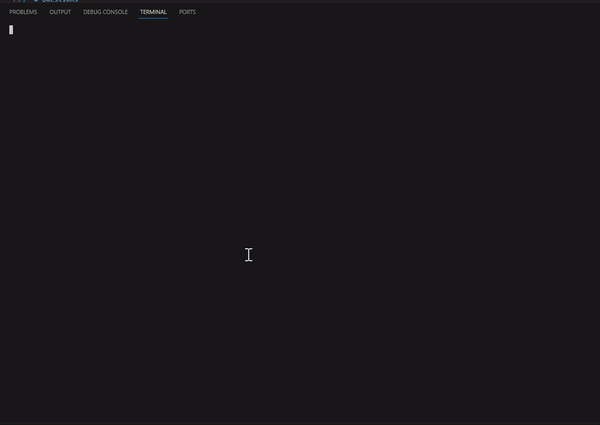
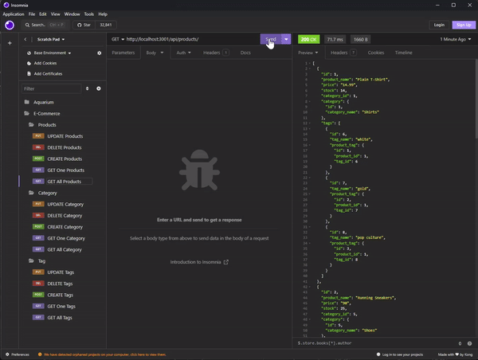

# ORM e-commerce

        
# Description

[](https://opensource.org/licenses/MIT)<br><br>

This repo contains e-commerce based data structure that enables get/post/put/delete requests to make changes into SQL database using sequalize npm package. It is a practice tool for an interaction between back end coding that works with database through sequelize, express, pg and dotenv.

# Table of Contents

* [Installation](#installation)
* [Usage](#usage)
* [License](#license)
* [Contributing](#contributing)
* [Questions](#questions)

# Installation

* You must install npm pacakages before you're able to run the command for running the terminal program.

    ```
    npm i
    ```

* Also, please ensure that your `.env.EXAMPLE` file is renamed to `.env` and content filled out with your postgresSQL user / password.
    ```
    DB_NAME='ecommerce_db'
    DB_USER=''
    DB_PASSWORD=''
    ```

* Next step is to run your postgres in the terminal and run the schema.sql file.

    ```
    psql -U postgres
    ```

    - enter your credential to login to postgres and then run the following commands in order

        ```postgres
        \i db/schema.sql
        ```
    - to exit postgres :
        ```
        \q
        ```

* Once installation is done for npm pacakages, you may run the terminal program by running the following command at root of the project:

    ```
    node server.js
    ```

* Afterwards, in order to test the get/put/post/delete api requests, [Insomnia (link to download)](https://insomnia.rest/download) is recommended for testing! Please note that no sign up is necessary to use insomina. You can just use the scratch pad!


# Usage

This app will help you grasp a better understanding of how relational tables work through sequelize, express, and pg modules. There are one-to-one, one-to-many and many-to-many relations between the tables. With these examples of seed data and code that is available, it should help you understand sequelize better on running complicated join statements on behalf of you with simpler commands!

[Click here for demo video!](https://youtu.be/FIgsVpQR_Nk)

- Below is the brief demo of installation process and running it through insomnia third party app.<br><br>



# License

Licensed by MIT License

# Contributing

Any contributions, issues, or feature requests are welcome!


# Questions

Please reach me via github or email if you have any questions, concerns, or remarks 😉<br><br>
    - [My Github Link](https://github.com/ericeya) <br>
    - eric.hyunil.lee@gmail.com
        
        